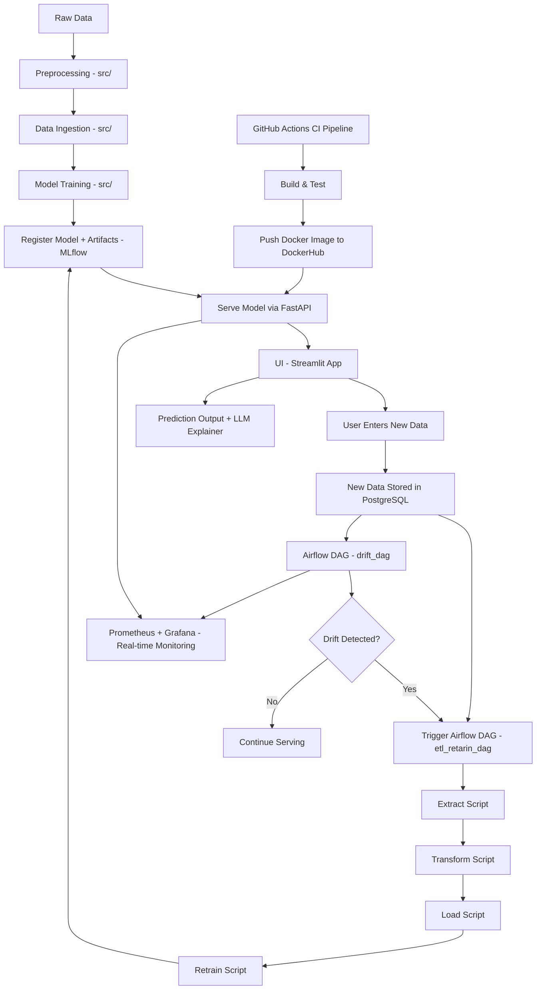

---

# 🚀 Bank Customer Subscription Prediction using MLOps

### 🛠️ FastAPI · Streamlit · Airflow · MLflow · DVC · Prometheus · Grafana · LLMs · Docker · CI/CD

---

## 📌 Project Summary

This project is a complete **MLOps pipeline** to predict whether a bank customer will subscribe to a term deposit based on campaign data. It integrates model training, monitoring, CI/CD automation, and explainability—all running within Docker containers and tracked using industry-standard tools.

---

## 🧱 Project Folder Structure

```
📁 .dvc/                    → DVC configurations  
📁 .github/workflows/       → GitHub Actions (CI/CD)  
📁 airflow/                 → Airflow DAGs (3 DAGs)  
📁 BACKEND/                 → FastAPI app (serving model)  
📁 FRONTEND/                → Streamlit app (user interaction)  
📁 Database_connection/     → PostgreSQL scripts  
📁 Drift_Detector/          → Evidently for drift detection  
📁 llm_explainer/           → LLM-based prediction explanation  
📁 mlflow/                  → MLflow tracking setup  
📁 monitoring/              → Prometheus + Grafana setup  
📁 scripts_dvc/             → Data versioning scripts  
📁 src/                     → Source code  
📄 docker-compose.yml       → Docker orchestration  
```

---

## 🧠 Tools & Frameworks Used

| Tool/Tech             | Purpose                                          |
| --------------------- | ------------------------------------------------ |
| 🐍 Python             | Core programming language                        |
| 📦 DVC                | Data versioning                                  |
| 📋 MLflow             | Model training tracking, registry, and artifacts |
| ⚙️ Airflow            | Pipeline scheduling and automation with 3 DAGs   |
| 🧠 FastAPI            | REST API to serve the ML model                   |
| 🌐 Streamlit          | UI for making and viewing predictions            |
| 📉 Evidently          | Drift detection in real-time                     |
| 📊 Prometheus/Grafana | Metrics monitoring for system and models         |
| 🐳 Docker & DockerHub | Containerization and image push                  |
| 🔐 PostgreSQL         | Structured database for input/output storage     |
| 🧠 LLM Explainer      | Explains predictions using OpenAI API            |
| 🚀 GitHub Actions     | CI/CD: test, build, push containers              |

---

## 🗃️ PostgreSQL Schema

* **Database**: `banking_costumer_data`
* **Tables**:

  * `temp_table_new_costumer` → temporary table for incoming data
  * `banking_new_data_history` → historical logs used in retraining

---

## 🔄 Airflow DAGs

| DAG Name          | Functionality                                   |
| ----------------- | ----------------------------------------------- |
| `drift_dag`       | Checks for data/model drift                     |
| `etl_retarin_dag` | ETL and retraining logic                        |
| `retrain_dag`     | Complete retrain + model registration in MLflow |

---

## 📊 Monitoring

* **Prometheus** collects metrics for model serving, system resource usage.
* **Grafana** displays real-time dashboards.
* **Evidently** tracks drift in production data and triggers retraining DAG.

---

## 🔍 Dataset Overview

### 📞 Bank Marketing (Term Deposit Subscription)

* **Source**: [UCI Bank Marketing Dataset](https://archive.ics.uci.edu/dataset/222/bank+marketing)
* **Rows**: 45,211 | **Features**: 17 + 1 Target

| Column      | Description                         |
| ----------- | ----------------------------------- |
| `age`       | Age of the client                   |
| `job`       | Type of job (admin, services, etc.) |
| `marital`   | Marital status                      |
| `education` | Education level                     |
| `default`   | Has credit in default               |
| `balance`   | Yearly balance                      |
| `housing`   | Has housing loan?                   |
| `loan`      | Has personal loan?                  |
| `contact`   | Contact type                        |
| `duration`  | Call duration                       |
| `campaign`  | Number of contacts in campaign      |
| `pdays`     | Days since last contact             |
| `previous`  | Past contacts                       |
| `poutcome`  | Outcome of previous campaign        |
| `y`         | **Target** (Subscribed: yes/no)     |

---

## 🐳 Docker + CI/CD

### ✅ GitHub Actions CI Workflow

```yaml
name: CI to DockerHub

on:
  push:
    branches: [main]

jobs:
  deploy:
    runs-on: ubuntu-latest
    steps:
      - uses: actions/checkout@v3

      - name: Log in to DockerHub
        uses: docker/login-action@v2
        with:
          username: ${{ secrets.DOCKER_USERNAME }}
          password: ${{ secrets.DOCKER_PASSWORD }}

      - name: Build Docker image
        run: docker build -t anuragraj03/tele_mlops

      - name: Push to DockerHub
        run: docker push anuragraj03/tele_mlops
```

---

## 🔧 How to Run Locally

### 1. Install Requirements

```bash
pip install -r requirements.txt
```

### 2. Set up Environment Variables

```bash
export OPENAI_API_KEY=your_openai_api_key_here
```

### 3. Start with Docker

```bash
docker-compose up --build
```

---

## ⚙️ Flow Diagram (Text)


---

### 🔁 **MLOps Workflow Diagram (Mermaid)**



---

### ✅ Key Components Mapped:

| Block                       | Description                                                             |
| --------------------------- | ----------------------------------------------------------------------- |
| `src/`                      | Handles all initial processing: cleaning, training, registering         |
| `FastAPI`                   | Exposes trained model as REST API                                       |
| `Streamlit`                 | UI for input & visual feedback                                          |
| `PostgreSQL`                | Stores incoming user data                                               |
| `Airflow - etl_retarin_dag` | Handles ETL + retraining pipeline                                       |
| `Airflow - drift_dag`       | Detects data drift and triggers retraining if needed                    |
| `MLflow`                    | Stores model versions and artifacts                                     |
| `Prometheus + Grafana`      | Monitors pipeline and model behavior                                    |
| `GitHub Actions`            | Automates CI: test, build, and push Docker images to DockerHub          |
| `LLM Explainer`             | Generates interpretable model explanations using OpenAI or similar LLMs |


---

## ⚠️ Notes & Prerequisites

* Set up your own OpenAI API key for LLM-based explanations.
* PostgreSQL must be running for real-time storage.
* Docker + DockerHub credentials must be added as GitHub Secrets:

  * `DOCKER_USERNAME`
  * `DOCKER_PASSWORD`

---

## 🧠 Use-Cases

| Use Case             | Reason                                                         |
| -------------------- | -------------------------------------------------------------- |
| Predict subscription | Direct use in marketing and targeting                          |
| Explain predictions  | Helps marketing managers understand model output (LLMs + SHAP) |
| Monitor drift        | Prevents outdated models from hurting performance              |
| Real-time dashboard  | DevOps-friendly setup for live system health monitoring        |

---

## 📜 License

This repository and dataset are distributed under the [CC BY 4.0 License](https://creativecommons.org/licenses/by/4.0/). Please give credit to the original authors.

---

## 🙌 Acknowledgments

* **Dataset**: Sérgio Moro, Paulo Rita, Paulo Cortez (2014)
* **Inspiration**: Full-stack MLOps pipelines using MLflow, Docker, DVC, and FastAPI.

---
## 📬 Contact
For collaboration, feedback, or queries:

📧 **Email**: anuragraj4483@gmail.com

💼 **LinkedIn**: linkedin.com/in/anurag-raj-770b6524a

📊 **Kaggle**: kaggle.com/anuragraj03/code

📬 **DockerHub**: https://hub.docker.com/repository/docker/anuragraj03/tele_mlops/general

